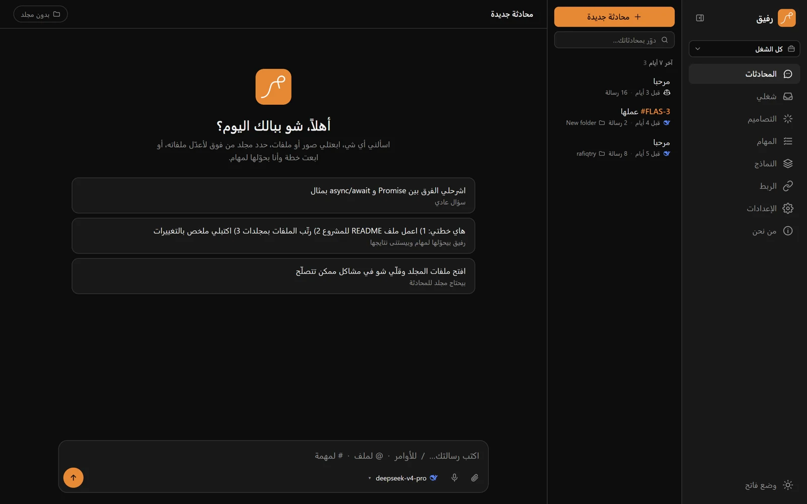
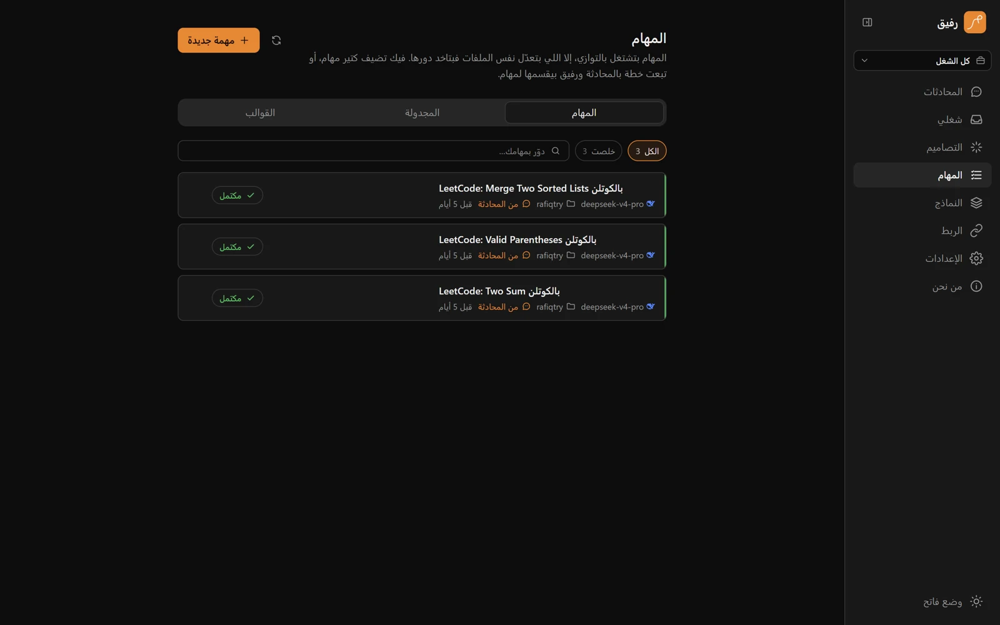
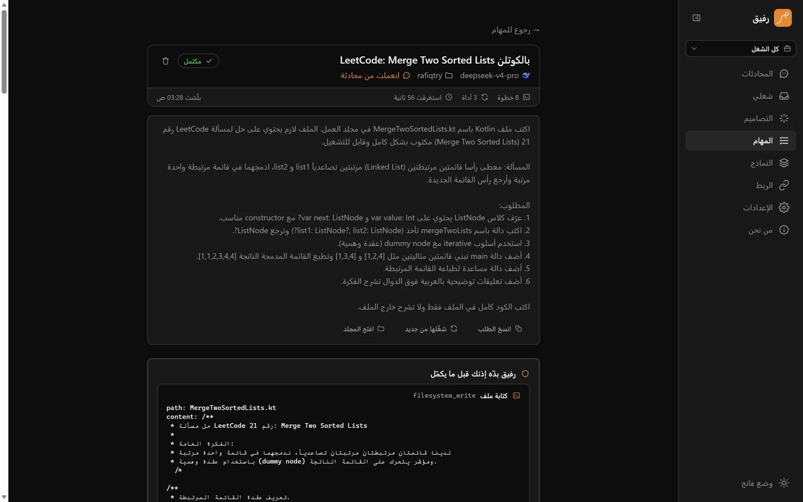
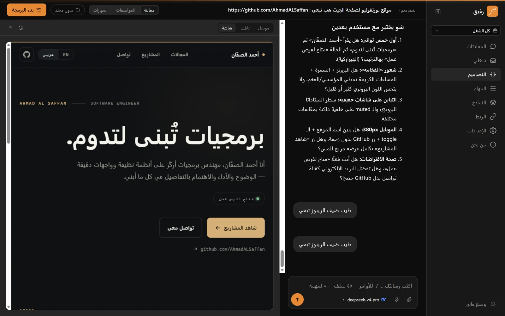
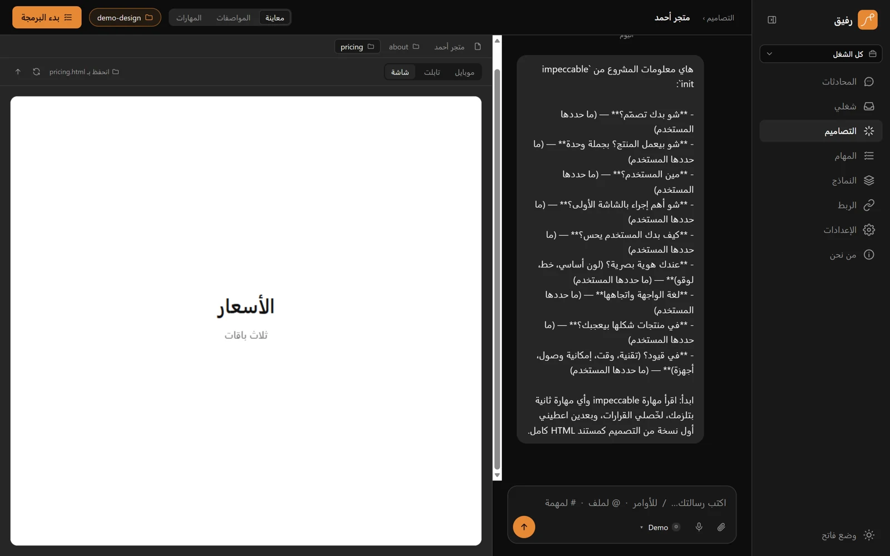
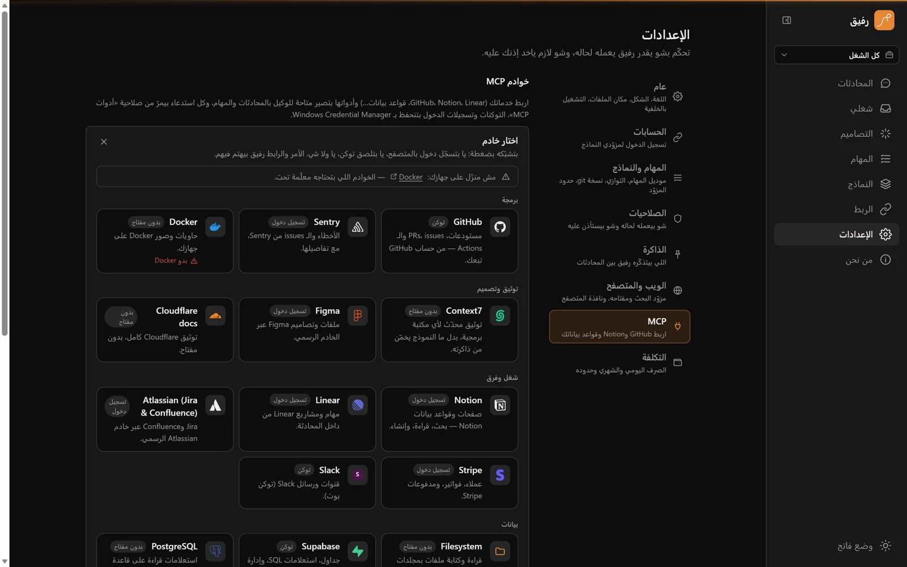
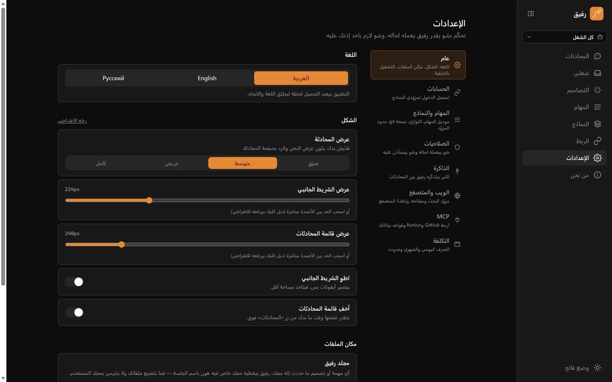
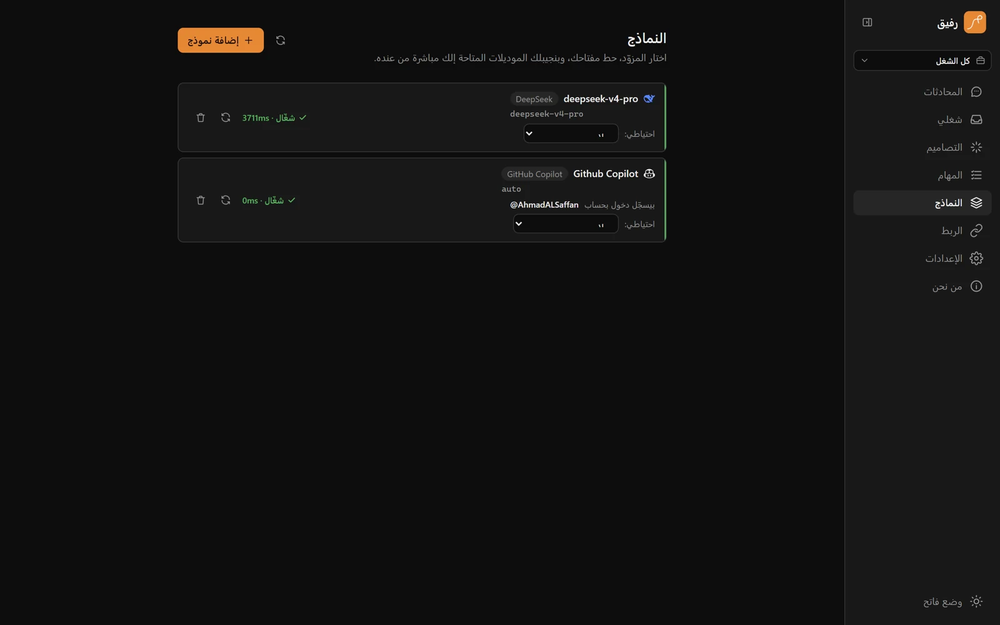

<div align="center">


#  Rafiq · رفيق
### An Arabic-first AI agent for Windows that works on your own machine

[](https://tauri.app/)
[](https://react.dev/)
[](https://www.typescriptlang.org/)
[](https://www.python.org/)
[](https://fastapi.tiangolo.com/)
[](#-getting-started)
[](#overview)
[](#)

<!--
### Website
[](https://YOUR-SITE-HERE)
-->

---
</div>

<!-- App demo — replace the src with the uploaded video/GIF link, then remove this comment wrapper.
<div align="center">
  <table>
    <tr>
      <td align="center" style="background:#1a1a1a; border-radius:24px; padding:12px; border: 2px solid #333;">
        
      </td>
    </tr>
  </table>
</div>

---
-->

## Overview

**Rafiq** (Arabic for *companion*) is a Windows desktop app developed by [AhmadALSaffan](https://github.com/AhmadALSaffan). You connect the AI model you already use — Anthropic, OpenAI, Gemini, DeepSeek, a local Ollama model, and more — and Rafiq gives it real tools to work with on your machine: it reads and writes files, runs commands, designs interfaces with a live preview, and follows up on your Jira, Linear, GitHub, and GitLab issues.

The whole interface is Arabic and right-to-left from the ground up, everything runs locally, and nothing sensitive happens without your approval.

> 🔑 **Bring your own model:** Rafiq has no account system and no cloud of its own. You add an API key for the provider you choose (stored in Windows Credential Manager), sign in with a GitHub account that has Copilot, or run a model locally with Ollama.

---

## Screenshots

<div align="center">

| Chat | Tasks |
|:---:|:---:|
|  |  |
| Stream a reply from any model you connected, with `/` commands, `@` for files and `#` for issues. | Hand work off and watch it run: live status, a plan to approve, and every step on the record. |

| One task, start to finish | Designs |
|:---:|:---:|
|  |  |
| Each tool call, each approval, the changed files and their diff — with one click to apply, revert or commit. | Design the interface before you build it: a live preview beside the conversation that shaped it. |

| Pick what the preview shows | MCP servers |
|:---:|:---:|
|  |  |
| The row above the preview lists every document of the design *and* every HTML file in its folder — one click swaps what you're looking at. | A catalogue of official servers: sign in through the browser, paste one token, or just connect. |

| Settings | Models |
|:---:|:---:|
|  |  |
| Eight sections down the side, each saying what's inside it. | Every provider in one place, each agent with its key, its fallback and its last check. |

</div>

---

## Features

- 💬 **Chat** — Stream replies from any connected model with Markdown, image and file attachments, `@` to reference files in the chat's folder, `#` to mention your tracker issues, and `/` commands to adjust reply length, language, temperature, and reasoning
- 🗜️ **Token control** — `/لخّص` folds older messages into a summary so long chats stop resending everything
- 🗂️ **Parallel tasks** — Hand off jobs and Rafiq works through them in the folders you pick, up to 100 at once (you set the limit). Tasks that would edit the same files take turns, and a task can wait for the ones it depends on. Each has live progress, re-run, and a full step-by-step transcript
- 🧩 **Plans → tasks** — Send a plan in chat and the model splits it into tasks, shows their live status in the chat, waits for them to finish, and replies with the results
- 🔁 **Replies that keep going** — Leave a chat mid-reply and the reply keeps being written; come back and it picks up live where it is
- 🌿 **A git worktree per task** — On a git repository, each task works in its own isolated copy (taken from the folder as it is, uncommitted files included), so tasks on one project run side by side; their changes are then applied back to your folder — never committed to your branch
- 🔍 **Review, revert, commit** — Every task on a git folder gets a changes panel: the files, the diff, one click to revert (or apply changes that didn't apply cleanly), and a commit of just that task's files — with a commit message and PR description the model writes from the diff
- 🗺️ **Plan first, or step by step** — A task can write its plan and wait for your approval (edit it first if you like) before touching anything, or ask before every single write and command
- 👀 **See the diff before you allow it** — When a task or chat wants to write a file, the permission card shows exactly what will change, not just the file name
- 🧠 **Memory across chats** — “Remember that I…” and Rafiq keeps it (behind its own permission, so you see what's saved); every later chat and task knows it, and Settings lets you edit or delete anything
- 🗂️ **Workspaces** — A project's folder, default model and standing instructions in one place; switch workspace and chats, tasks and designs filter to it
- 📤 **Share a chat** — Export any chat as a single self-contained HTML page (light and dark, tool cards included) or as Markdown
- 🧩 **Skills you install** — Paste a GitHub repository, a folder in one, a raw `SKILL.md` or a zip and it becomes a skill; skills can bring their own `/` commands, announced when they land. Two bundled design skills (`design-taste`, Vercel's `web-interface-guidelines`) keep generated UI from looking generated
- ⌨️ **`rafiq` on the command line** — `rafiq task "…" --wait`, `rafiq chat "…"`, `rafiq tasks`, `rafiq approve` — from any terminal while the app runs (see `API.md`)
- 📌 **Project instructions** — Put a `RAFIQ.md` (or `AGENTS.md`) in a project and every chat and task there reads it first: build commands, conventions, what not to touch
- 🔌 **MCP servers, one click** — A catalogue of official servers with their logos: sign in through the browser (Notion, Linear, Atlassian, Sentry, Stripe, Figma — OAuth with PKCE, tokens in Windows Credential Manager, refreshed automatically), paste one token (GitHub, Supabase, Brave, Slack), or just connect (Playwright, Fetch, Context7, Docker…). No command lines unless you pick “custom”. Rafiq says when Node, uv or Docker is missing and turns a failed connection into a reason you can act on (a 401 is “token wrong or expired”, not “TaskGroup error”)
- 🌍 **Web and browser** — `web_fetch` reads pages and PDFs as text; `web_search` uses Brave, Tavily, or your own SearXNG; and a real browser (Microsoft Edge, with its own profile) lets the agent click, type, and test `localhost` apps
- 🖱️ **Desktop control** — Off by default: screenshots, mouse and keyboard on any app, one run at a time, every action behind its permission
- ⏰ **Scheduled tasks and templates** — Run a task every N minutes, daily, or on chosen weekdays; save tasks you repeat as templates, import and export them as JSON, or pull from the community catalogue
- 🚦 **Provider limits** — Requests per provider key are capped (the rest wait instead of failing with 429), rate limits and outages are retried with backoff, and each agent can have a fallback agent
- 🪟 **Runs in the background** — Closing the window keeps Rafiq in the tray with Windows notifications for finished tasks and approvals; it can start with Windows, and it never leaves its agent process running after you quit
- 🎨 **Designs** — A brief (`/impeccable init`), bundled design skills that work with every model, a live HTML preview at phone/tablet/desktop widths, and a one-click hand-off to the session that will build it. You choose what the preview shows: every document of the design (a second screen adds one instead of replacing the first) and every HTML file in the design's folder, including ones the model wrote with its own tools
- 📥 **My Work** — Issues assigned to you across Jira Cloud, Linear, GitHub Issues, and GitLab Issues in one inbox: change status, comment, or turn an issue into a task
- 🧠 **Any model** — Anthropic, OpenAI, Google Gemini, DeepSeek, Groq, Mistral, xAI, OpenRouter, Azure OpenAI, AWS Bedrock, Google Vertex AI, Cerebras, Fireworks, Together, Qwen (DashScope), Kimi (Moonshot), GLM (Z.ai), Ollama and LM Studio (local), or any OpenAI-compatible endpoint
- 💵 **Cost and budgets** — Every call's tokens and price are recorded per agent and per day; set a daily or monthly limit and Rafiq stops calling the provider once it's reached
- 🎙️ **Dictation** — Speak your message instead of typing it, using the speech model of a provider you already configured
- ✏️ **Edit and fork** — Reword a question you already asked and send it again, or fork a chat from any point to try another direction without losing this one
- ⬆️ **Updates in the app** — Rafiq checks its releases page for a newer signed version, downloads it, and restarts into it
- 🩺 **Diagnostics report** — One click saves a JSON report (version, settings, model providers, MCP server names) with no keys and nothing from your conversations
- 🐙 **GitHub Copilot sign-in** — Connect a GitHub account with an active Copilot plan through GitHub's device flow and the official Copilot SDK — no key, no password in Rafiq; each agent uses the account you pick for it
- 🔗 **OpenRouter sign-in** — Approve Rafiq on openrouter.ai (OAuth PKCE) instead of pasting a key; the issued key goes straight to Windows Credential Manager
- 🧪 **AuthAI (experimental, off by default)** — An optional adapter for the third-party [AuthAI](https://github.com/authai-io/authai) relay. Unofficial and not affiliated with any provider; see the warning in Settings before enabling it
- 🛡️ **Permission policy** — Every tool that writes files, runs commands, manages processes, browses, controls the desktop, calls MCP tools, or edits issues is set to *ask*, *allow*, or *deny* — per category, from Settings
- 🔐 **Local-first** — Chats, tasks, and designs live in a local SQLite database; API keys go to Windows Credential Manager, never into the database
- 🌐 **Arabic, English, Russian** — Arabic-first and right-to-left, with full English and Russian translations (left-to-right) switchable from Settings — including messages from the agent
- 🌗 **Light & dark** — A warm `#e68835` accent and both themes

---

## Tech Stack

| Layer | Technology |
|---|---|
| Desktop shell | Tauri 2 (Rust) |
| UI | React 19 · TypeScript · Tailwind CSS 4 · Motion |
| Agent runtime | Python 3.11+ · FastAPI · Uvicorn |
| Model layer | LiteLLM · GitHub Copilot SDK (optional) |
| Tools | MCP Python SDK · Microsoft Edge over the DevTools protocol · Win32 input · git worktrees |
| Database | SQLite via SQLAlchemy (async) + aiosqlite |
| Secrets | `keyring` → Windows Credential Manager |
| Packaging | PyInstaller (agent) · NSIS installer (Tauri bundler) · signed updates (Tauri updater) |
| Quality | Vitest · ESLint · pytest · Ruff |

---

## 🚀 Getting Started

### Prerequisites

- Windows 10 or 11 (x64)
- An API key for at least one supported provider — or [Ollama](https://ollama.com/) running locally

For building from source you also need:

- [Node.js](https://nodejs.org/) 20+ and pnpm 10 (`corepack enable`)
- [Python](https://www.python.org/) 3.11+
- [Rust](https://rustup.rs/) with Visual Studio Build Tools (*Desktop development with C++*)

### 1 — Download the Installer

To try Rafiq directly on Windows:

<!-- Link this to the release once it is published. -->
[⬇️ Download for Windows](https://github.com/AhmadALSaffan/Rafiq/releases/latest)

Run `Rafiq_<version>_x64-setup.exe`. It installs for the current user (no administrator rights needed), in Arabic or English, and adds Rafiq to the Start menu and desktop.

> ⚠️ The installer is not code-signed yet, so Windows SmartScreen may show a warning. Choose **More info → Run anyway**. You can check the download against `SHA256SUMS.txt` from the same release:
>
> ```powershell
> Get-FileHash .\Rafiq_0.4.0_x64-setup.exe -Algorithm SHA256
> ```

### 2 — Clone the Repository (Developers)

```bash
git clone https://github.com/AhmadALSaffan/Rafiq.git
cd Rafiq
pnpm install
```

### 3 — Set Up the Agent

```bash
cd apps/agent
python -m venv .venv
.venv\Scripts\pip install -e ".[dev,copilot]"
```

### 4 — Run

```bash
cd apps/desktop
pnpm tauri dev
```

Tauri picks a free port and a random token, starts the agent from `apps/agent/.venv`, and hands both to the UI — there is no separate server to start.

### 5 — Test

```bash
cd apps/desktop && pnpm check          # TypeScript + ESLint + Vitest
cd apps/agent && .venv\Scripts\ruff check . && .venv\Scripts\python -m pytest -q
```

### 6 — Build the Installer

```bash
cd apps/desktop
pnpm release
```

This runs the checks, freezes the agent with PyInstaller, builds the NSIS installer, and writes a release-ready copy to `release/Rafiq_<version>_x64-setup.exe` together with `release/SHA256SUMS.txt`.

---

## Configuration

Rafiq works without any configuration. These optional environment variables are read by the agent:

```env
RAFIQ_DATA_DIR=        # where the database, attachments, and your own skills live (default: %APPDATA%\Rafiq)
RAFIQ_WORKSPACE_DIR=   # where tasks and designs without a chosen folder save files (default: Documents\Rafiq)
RAFIQ_TOKEN=           # bearer token for the local API (set automatically by the desktop app)
RAFIQ_CORS_ORIGINS=    # comma-separated allowed origins (defaults cover the app and the dev server)
RAFIQ_GITHUB_CLIENT_ID= # GitHub OAuth App (device flow) used for Copilot sign-in — set this in a fork
```

### Where your data lives

| What | Where |
|---|---|
| Chats, tasks, designs, settings | `%APPDATA%\Rafiq\rafiq.db` |
| Attachments | `%APPDATA%\Rafiq\attachments` |
| Your own skills | `%APPDATA%\Rafiq\skills` |
| Files from tasks and designs with no folder | `Documents\Rafiq\tasks\…` and `Documents\Rafiq\designs\…` |
| API keys, account tokens, tracker tokens | Windows Credential Manager |
| Agent log (installed app) | `%APPDATA%\Rafiq\agent.log` |
| Discovery file for the `rafiq` command (while running) | `%APPDATA%\Rafiq\agent.json` |

All of these sit outside the install folder, so updating or reinstalling Rafiq never touches your data.

---

## Architecture

```text
┌──────────────────────────── Rafiq.exe (Tauri 2 · Rust) ────────────────────────────┐
│  React UI (RTL)  ──HTTP / SSE / WebSocket + bearer token──►  rafiq-agent (FastAPI) │
│        ▲                                                         │                 │
│        └── picks a free port + random token, spawns the agent ◄──┘                 │
└────────────────────────────────────────────────────────────────────────────────────┘
                                                                    │
                     LiteLLM ──► the provider you chose (or local Ollama)
                     Tools   ──► files · shell · processes · issue trackers · skills
                                 (write/exec tools pass the permission policy first)
```

### Project Structure

```text
Rafiq/
├── apps/
│   ├── desktop/                      # Tauri 2 · React 19 · TypeScript · Tailwind 4 (Arabic-first, RTL)
│   │   ├── src/
│   │   │   ├── App.tsx               # routes
│   │   │   ├── components/           # shared UI
│   │   │   │   ├── Shell.tsx         #   nav, workspace switcher, task toasts
│   │   │   │   ├── ChatCommands.tsx  #   /help, reply settings, export dialogs
│   │   │   │   ├── ComposerMenus.tsx #   the `/ @ #` menus and the command list
│   │   │   │   ├── steps.tsx         #   tool cards and the permission card (with its diff)
│   │   │   │   ├── DiffView.tsx      #   one coloured unified diff, used by both
│   │   │   │   ├── McpLogo.tsx       #   logos of the catalogue's MCP servers
│   │   │   │   └── WorkspaceSwitcher.tsx
│   │   │   ├── features/
│   │   │   │   ├── chat/             #   the chat screen, composer, transcript, dictation
│   │   │   │   ├── tasks/            #   list, detail, plan approval, changes panel, templates, schedules
│   │   │   │   ├── design/           #   the skills section of the designs page
│   │   │   │   ├── work/             #   the tracker inbox
│   │   │   │   ├── settings/         #   agent · web · memory · MCP · usage sections
│   │   │   │   ├── accounts/         #   sign-in with a provider account
│   │   │   │   └── updates/          #   the in-app updater card
│   │   │   ├── routes/               # models · designs · design workspace · integrations · settings · about
│   │   │   ├── lib/                  # api/ (one module per domain), types, workspace, mcpCatalog, layout, bidi, time
│   │   │   └── i18n/                 # Arabic source strings + en.ts · ru.ts (+ a test that enforces coverage)
│   │   ├── src-tauri/                # Rust shell: spawns the agent, Windows file icons, tray, NSIS installer
│   │   │   └── resources/rafiq.cmd   #   the `rafiq` command installed beside the app
│   │   └── scripts/                  # build-app.mjs (PyInstaller + Tauri) · release.mjs (checksums + latest.json)
│   └── agent/                        # Python 3.11+ · FastAPI · SQLite · the whole agent runtime
│       ├── rafiq_agent/
│       │   ├── main.py               # the app: routers, lifespan, the CLI discovery file
│       │   ├── cli.py                # the `rafiq` command (standard library only)
│       │   ├── api/                  # routes: chats · tasks · designs · models · accounts · settings ·
│       │   │                         #   automation (templates, schedules, MCP) · memory · workspaces ·
│       │   │                         #   integrations · attachments · files · insights · voice
│       │   ├── core/
│       │   │   ├── loop.py           #   the tool-use loop every provider goes through
│       │   │   ├── chat_service.py   #   one chat turn: context, streaming, permissions, design sync
│       │   │   ├── agent_runtime.py  #   one task: tools, plan-first and step-by-step modes
│       │   │   ├── manager.py        #   parallel tasks: claims, dependencies, the queue
│       │   │   ├── gitops.py         #   git plumbing  ·  task_git.py — a worktree per task
│       │   │   ├── git_describe.py   #   commit message and PR text from a diff
│       │   │   ├── memory.py         #   what Rafiq remembers between chats
│       │   │   ├── designs.py        #   the brief, the documents, the design prompt
│       │   │   ├── export_html.py    #   a chat as one self-contained page
│       │   │   ├── prompts.py        #   every instruction Rafiq sends a model
│       │   │   └── schedules.py · tasks_service.py · attachments.py · project_notes.py · workspace.py
│       │   ├── llm/                  # LiteLLM wrapper · Copilot SDK · discovery · presets (native tools) ·
│       │   │                         #   resilience (limits, retries, fallback) · usage (cost and budgets)
│       │   ├── auth/                 # API keys and account sign-in (GitHub Copilot, OpenRouter) + resolve.py
│       │   ├── tools/                # filesystem · shell · process · web · browser · desktop · skills ·
│       │   │                         #   tasks · memory  (+ os_adapters/windows.py)
│       │   ├── mcp_bridge.py         # MCP servers as tools  ·  mcp_oauth.py — their browser sign-in
│       │   ├── integrations/         # Jira · Linear · GitHub · GitLab
│       │   ├── skills/               # registry.py (+ commands) · install.py (from a URL) · bundled/
│       │   ├── schemas/              # the API's request and response models
│       │   ├── storage/              # SQLAlchemy models · migrations · keyring secrets
│       │   ├── data/                 # the community task templates that ship with the app
│       │   └── i18n.py · locales.py  # the agent speaks the UI's language too
│       ├── tests/                    # pytest — the loop, parallelism, git, skills, MCP, i18n, features
│       └── rafiq-agent.spec          # PyInstaller build
├── docs/screenshots/                 # the images in this file
├── site/ · site-src/                 # the marketing site (static, generated by site-src/build.py)
├── brand/                            # logo sources
├── release/                          # the built installer, its checksum and latest.json
├── API.md                            # the local API and the `rafiq` command
├── ARCHITECTURE.md                   # layer-by-layer guide (Arabic)
├── GUIDE.md                          # full user & developer guide (Arabic)
├── DESIGN.md · PRODUCT.md            # the design system and the product decisions
└── README.md
```

For a deeper tour — every layer, and "where do I change…" — see [ARCHITECTURE.md](ARCHITECTURE.md). The complete Arabic guide, including every chat command, is in [GUIDE.md](GUIDE.md).

---

## Contributing

Pull requests are welcome! For major changes, please open an issue first to discuss what you'd like to change.

1. Fork the repo
2. Create your feature branch: `git checkout -b feature/your-feature`
3. Run the checks: `pnpm check` in `apps/desktop`, `ruff` + `pytest` in `apps/agent`
4. Commit your changes: `git commit -m "feat: add your feature"`
5. Push to the branch: `git push origin feature/your-feature`
6. Open a Pull Request

---

## License

```text
No license has been chosen for Rafiq yet — any help, feedback, or contributions are more than welcome!
```

The bundled design skills by [Emil Kowalski](https://github.com/emilkowalski/skills) are MIT-licensed; their license ships alongside them in `apps/agent/rafiq_agent/skills/bundled/`.

---

<div align="center">
  Built with ❤️ by <a href="https://github.com/AhmadALSaffan">Ahmed Eliwi AL Saffan · أحمد عليوي السفان</a>
</div>
